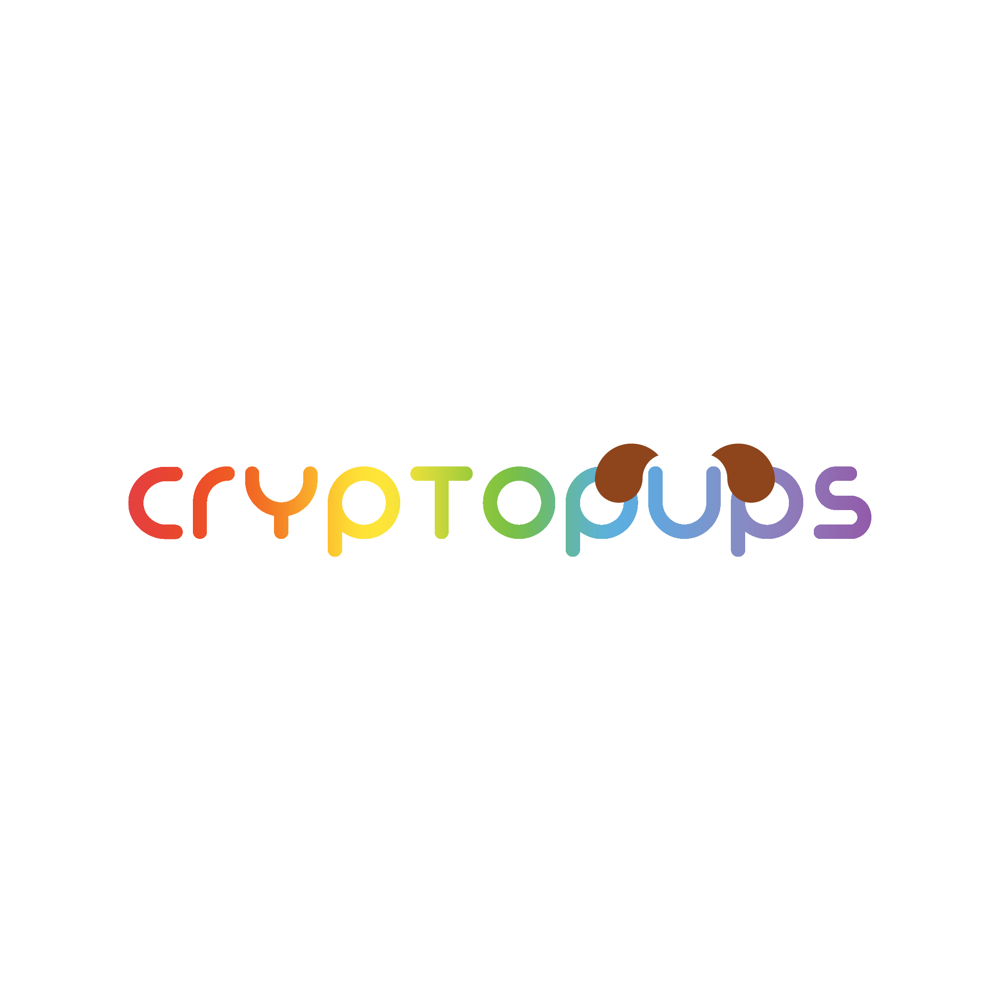

<div align="center">
    <a href="https://cryptopups.cf/" rel="noreferrer"></a>
</div>

## About

... Where cute, cool, beautiful and amazingly crafted puppies reside, `pups` all the way to the moon!

### Info

This is the official website source code of **`The World of CryptoPups`**.

## Development

- clone the project (it is heavy because of the images) [**please do not share anywhere the images that reside inside `public/images`**]

```
git clone https://github.com/TheBoringDude/cryptopups.git
```

- run the **`NextJS`** dev server

```
yarn dev
```

### Things to note:

- all images are hard-coded (this is for better image handling) [will shift to `cloudinary`]

##

###
